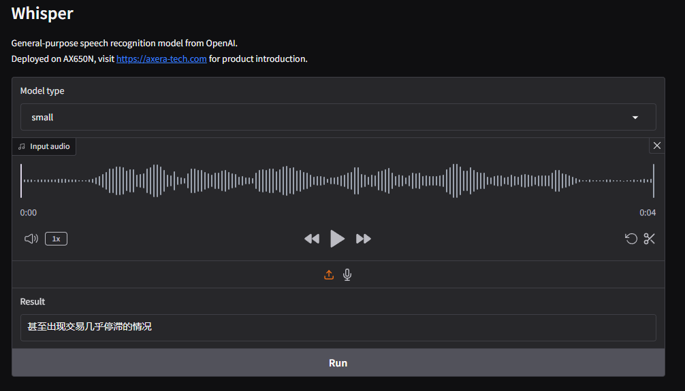
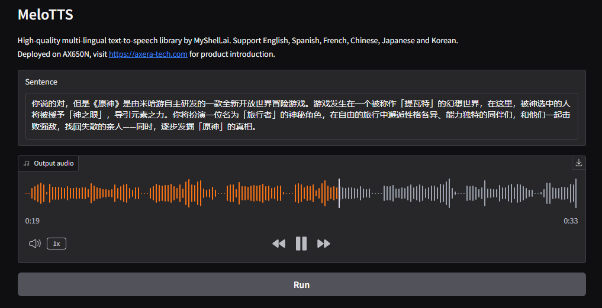

# awesome-axera
All kinds of deep learning applications on Axera(axera-tech.com) 

## 运行前提
SSL证书生成：
openssl req -x509 -newkey rsa:4096 -keyout key.pem -out cert.pem -sha256 -days 365 -nodes

## 运行
在对应项目目录下:
```
python app.py
```

## 运行界面
### Whisper


### MeloTTS
